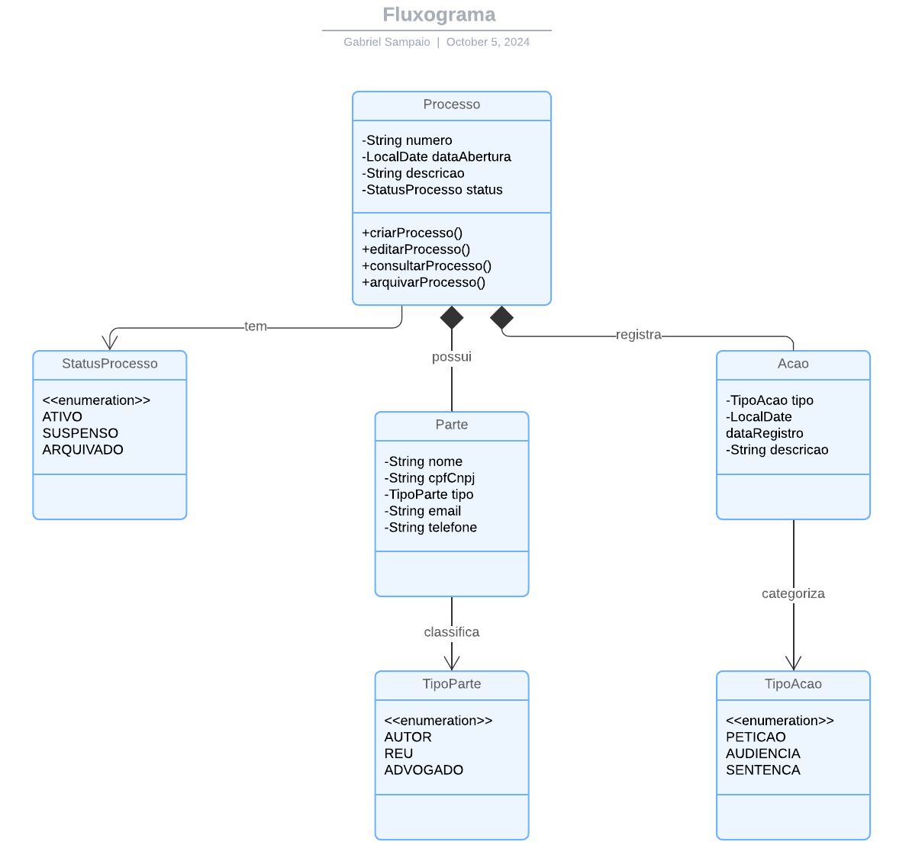
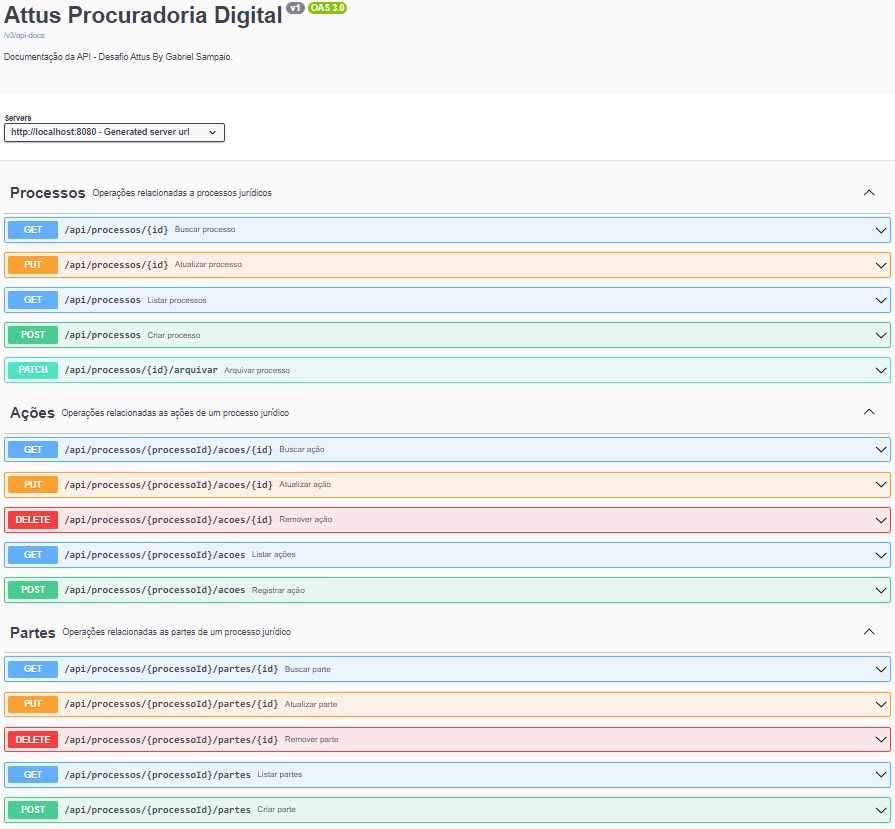
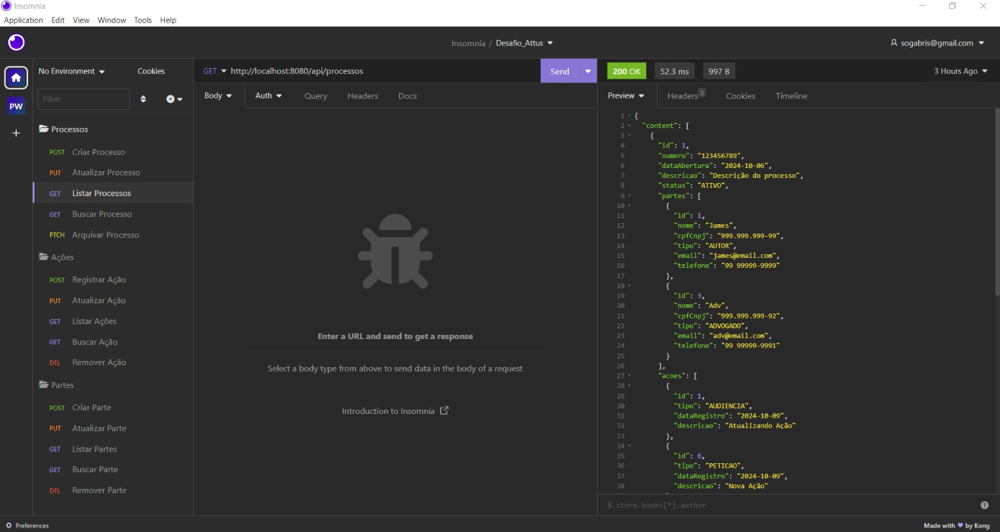
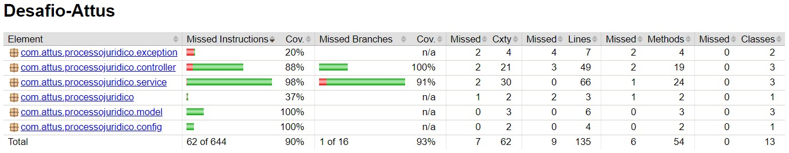
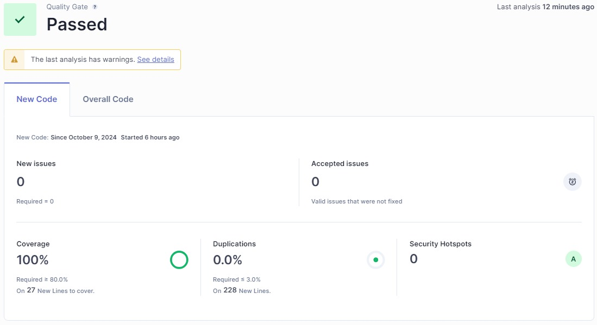

# Sistema de Processos Jurídicos - Desafio para a empresa Attus

## Descrição
Este projeto é uma API para gerenciamento de processos jurídicos, desenvolvida como parte do desafio para a equipe de backend da Attus Procuradoria Digital. A API permite criar, editar, consultar e arquivar processos, gerenciar as partes envolvidas e registrar ações associadas a cada processo.

## Índice
- [Descrição](#descrição)
- [Avaliação Teórica](#avaliação-teórica)
- [Tecnologias Utilizadas](#tecnologias-utilizadas)
- [Requisitos para Executar o Projeto](#requisitos-para-executar-o-projeto)
- [Instalação](#instalação)
- [Estrutura do Projeto](#estrutura-do-projeto)
- [Diagrama de Classes](#diagrama-de-classes)
- [Endpoints](#endpoints)
- [Resultados](#resultados)
- [Jacoco](#jacoco)
- [SonarQube](#sonarqube)
- [Como Executar o Projeto](#como-executar-o-projeto)
- [Licença](#licença)

## Avaliação Teórica
1. **Considere que você é o desenvolvedor responsável por uma nova funcionalidade para um sistema de e-commerce. A data inicial que você havia previsto está próxima e você nota que está atrasado para a entrega e ainda há testes na aplicação pendentes de correção após suas alterações. Seu líder na daily lhe cobra um posicionamento acerca do item. O que você faria nesse cenário e qual seria sua resposta?**
    - Resposta: 

        Entendo a preocupação com o prazo, eu não me esqueci do prazo final para entrega, apenas estou trabalhando da melhor maneira para entregarmos um bom resultado final sobre o projeto. Inclusive, as funcionalidades principais do sistema estão concluídas, no entanto, venho observando algumas falhas nos testes finais, e é nesse ponto que estou trabalhando para corrigir.

        Acredito que ainda não precisamos informar a empresa sobre um possível atraso, porque estou avançando para corrigir.

        Penso que posso trabalhar por algumas horas extras nos próximos dias para avançar no tempo. E também, se possível, realizamos uma reunião antes da primeira entrega, para avaliação geral da equipe.

2. **Considere que você está trabalhando há dias em uma implementação complexa, e pelo estágio da implementação o prazo acordado será cumprido, mas seu líder imediato solicita que você atue em uma implementação emergencial, que não havia sido identificada na etapa de levantamentos, e deve ser entregue no dia seguinte.
   Quais seriam suas considerações e encaminhamento nesse cenário?**
    - Resposta:

      Diante dessa situação, eu buscaria comunicar de forma clara e assertiva com meu líder. Explicaria que a implementação em que estou trabalhando é complexa, mas já está na fase final, dentro do prazo acordado. Se puder concluir essa etapa primeiro, conseguirei garantir essa entrega. Após finalizar, me comprometeria a atuar na demanda emergencial com foco total, inclusive me disponibilizando para fazer hora extra, se necessário, para que ambas as entregas sejam feitas da melhor forma possível, sem comprometer a qualidade.

3. **Considere que você acabou de concluir e liberar uma nova funcionalidade para produção, em pouco tempo os usuários começam a reportar problemas na mesma e você é acionado para avaliar e resolver o problema.
   Na sua opinião, quais seriam as ações a serem realizadas do momento em que o problema chegou ao seu conhecimento até a correção dele?**
    - Resposta:

      Ao ser informado sobre o problema, minha primeira ação seria reproduzir o erro em um ambiente de testes para entender sua origem e gravidade. Em seguida, focaria em identificar a causa raiz e buscar a solução mais eficiente, priorizando a correção com menor risco de impacto. Manteria todos informados sobre o progresso e, se necessário, aplicaria medidas temporárias para mitigar os danos. Depois de corrigir o problema, faria testes mais elaborados antes de liberar a correção e continuaria acompanhando o sistema para garantir que o problema não reapareça.

4. **Considere que você está trabalhando em uma implementação complexa, e estratégica para viabilizar uma entrega contratual, cujo prazo não pode ser repactuado, e durante a implementação atrasos ocorreram por conta de itens que não estavam claros na especificação, levando você a estimar um atraso de um dia na entrega prevista.
   Quais seriam suas considerações e encaminhamento nesse cenário?**
    - Resposta:

      Diante da situação, meu primeiro passo seria comunicar imediatamente o atraso estimado ao meu líder e à equipe envolvida. É fundamental ser transparente sobre os desafios encontrados, especialmente quando os itens não estavam claros na especificação. Além disso, analisaria as causas do atraso para identificar se há soluções alternativas que possam ajudar a minimizar o impacto no cronograma. Consideraria a possibilidade de priorizar tarefas críticas ou buscar apoio adicional da equipe, se necessário. Ao mesmo tempo, reforçaria a importância da entrega desse projeto e me comprometeria a fazer o possível para manter a qualidade e atender aos requisitos contratuais dentro do novo prazo.

## Tecnologias Utilizadas
- Java 17
- Spring Boot 3.3.4
- Spring Data JPA
- PostgreSQL
- Maven
- Lombok
- JUnit
- Swagger (Springdoc OpenAPI)
- Jacoco
- SonarQube
- IntelliJ IDEA
- Insomnia

## Requisitos para Executar o Projeto
- JDK 17
- Maven
- Banco de dados PostgreSQL
- Banco de dados H2 Database para os testes

## Estrutura do Projeto
    ```
    processo-juridico/
    ├── src
    │   ├── main
    │   │   ├── java
    │   │   └── resources
    │   └── test
    ├── pom.xml
    └── README.md
    ```
* **model**: Contêm as entidades da aplicação, como `Processo`, `Parte`, `Acao`, `StatusProcesso`, `TipoAcao` e `TipoParte`.
* **repository**: Interfaces para acesso aos dados das entidades, como `ProcessoRepository`, `AcaoRepository` e `ParteRepository`.
* **service**: Contêm a lógica de negócios e regras de validação, como `ProcessoService`, `ProcessoServiceImpl`, `AcaoService`, `AcaoServiceImpl`, `ParteService` e `ParteServiceImpl`.
* **controller**: Endpoints REST para interagir com a aplicação, mapeados nas classes de controlador.
* **exception**: Pacote que contém as classes de exceções personalizadas, como `NotFoundException` e `ValidationException`.
* **config**: Classe de configuração do Swagger para documentação da API.

## Diagrama de Classes

O diagrama de classes apresenta a estrutura das principais entidades do sistema. Ilustrando como as classes se relacionam entre si e quais atributos e métodos cada uma possui. As entidades principais incluem `Processo`, `Parte` e `Acao`, além de suas respectivas classificações e status.



## Como Executar o Projeto

1. Clone o repositório:
   ```bash
   git clone https://github.com/gabriel61/Desafio-Attus.git
   ```
2. Navegue até o diretório do projeto:
   ```bash
   cd processo-juridico
   ```
3. Compile e execute o projeto usando Maven:
   ```bash
   cd mvn spring-boot:run
   ```
4. A aplicação estará rodando em `http://localhost:8080`.


5. Acesse a documentação da API com Swagger em `http://localhost:8080/swagger-ui/index.html#/`.



## Configuração do Banco de Dados

No arquivo `src/main/resources/application.properties`, configure as credenciais do banco de dados:

    spring.application.name=Desafio-Attus
    spring.datasource.url=jdbc:postgresql://localhost:5432/processo_juridico
    spring.datasource.username=postgres
    spring.datasource.password=admin
    spring.jpa.hibernate.ddl-auto=update
    spring.jpa.properties.hibernate.dialect=org.hibernate.dialect.PostgreSQLDialect
    spring.jpa.show-sql=true
    spring.jpa.properties.hibernate.format_sql=true
    

## Endpoints da API

### Processos

- **Criar Processo**:  
  `POST /api/processos` - Cria um novo processo.  
  
  **Exemplo de requisição**:  
  ```json
  {
    "numero": "223456789",
    "dataAbertura": "2024-10-06",
    "descricao": "Descrição do processo",
    "status": "ATIVO"
  }
  ```
- **Listar Processos**:  
  `GET /api/processos` - Lista todos os processos.

- **Buscar Processo**:  
  `GET /api/processos/{id}` - Busca um processo por ID.

- **Atualizar Processo**:  
  `PUT /api/processos/{id}` - Atualiza um processo existente.

- **Arquivar Processo**:  
  `PATCH /api/processos/{id}/arquivar` - Arquiva um processo.

### Ações

- **Registrar Ação**:   
  `POST /api/processos/{processoId}/acoes` - Registra uma nova ação em um processo.

  **Exemplo de requisição**:  
  ```json
  {
   "tipo": "Audiência",
   "data": "2024-10-07",
   "descricao": "Descrição da audiência"
  }
  ```
- **Listar Ações**:  
  `GET /api/processos/{processoId}/acoes` - Lista todas as ações de um processo.
- **Buscar Ação**:  
  `GET /api/processos/{processoId}/acoes/{acaoId}` - Busca uma ação por ID.
- **Atualizar Ação**:  
  `PUT /api/processos/{processoId}/acoes/{acaoId}` - Atualiza uma ação existente de um processo.
- **Remover Ação**:  
  `DELETE /api/processos/{processoId}/acoes/{acaoId}` - Remove uma ação de um processo.

### Partes
- **Criar Parte**:  
  `POST /api/processos/{processoId}/partes` - Adiciona uma nova parte a um processo.
- **Listar Partes**:  
  `GET /api/processos/{processoId}/partes` - Lista todas as partes de um processo.
- **Buscar Parte**:  
  `GET /api/processos/{processoId}/partes/{parteId}` - Busca uma parte por ID.
- **Atualizar Parte**:  
  `PUT /api/processos/{processoId}/partes/{parteId}` - Atualiza uma parte existente de um processo
- **Remover Parte**:  
  `DELETE /api/processos/{processoId}/partes/{parteId}` - Remove uma parte de um processo.

### Importação do Insomnia
Para facilitar o uso dos endpoints, você pode importar o arquivo `insomnia_collection.json` no Insomnia. Ele contém algumas das principais collections que implementei.



## Jacoco
Para gerar relatórios de cobertura de testes com Jacoco, execute:  
    ```
    mvn clean install 
    ```  
    ```
    mvn clean test
    ```   
    ```
    mvn jacoco:report
    ```  

O relatório será gerado em `./target/site/jacoco/index.html`.



## SonarQube

### Como Rodar o SonarQube
Para iniciar o SonarQube, siga os passos abaixo:

1. **Download**: Acesse o site da SonarSource e baixe a versão mais recente do SonarQube em [https://www.sonarsource.com/products/sonarqube/downloads/](https://www.sonarsource.com/products/sonarqube/downloads/).

2. **Extrair o Arquivo**: Após o download, extraia o arquivo compactado.

3. **Acessar a Pasta**: Navegue até a pasta onde o SonarQube foi extraído. Para Windows, o caminho geralmente é:   
   `.\sonarqube-10.7.0.96327\bin\windows-x86-64`.

4. **Executar o SonarQube**: Dentro da pasta, execute o arquivo `StartSonar.bat` para iniciar o servidor SonarQube.

Siga essas etapas para começar a usar o SonarQube e realizar análises de qualidade de código em seus projetos.

### Para executar a análise do SonarQube, execute:  
    
    mvn clean verify sonar:sonar

O relatório pode ser visualizado no link gerado no prompt ou em: `http://localhost:9000`



## Licença

Este projeto está licenciado sob a Licença MIT. Veja o arquivo [LICENSE](LICENSE) para mais detalhes.

<br>

## ✒️ Autor

<br>

<a href="https://github.com/gabriel61">
 
<br>

[](https://www.linkedin.com/in/gabriel-oliveira-852759190/)
<br>
sogabris@gmail.com
<br>
